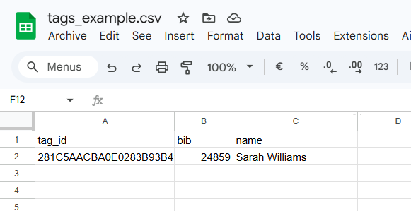

# Racetag Frontend (minimal)

A tiny static web UI to test and visualize live race standings from the [racetag-backend](https://github.com/paclema/racetag-backend) backend API. It fetches an initial snapshot and listens to server-sent events (SSE) for real-time updates.


Features:
- Connect to a backend (default http://localhost:8600)
- Show current standings
- Live updates via SSE (/stream)
- Import CSV file to map tag IDs to bib numbers and participant names

## CSV Import

The frontend can import a CSV file to display human-readable information (bib numbers and names) instead of raw tag IDs in the standings table since the backend do not provide yet this information.

#### CSV Format

The CSV file must contain three columns with headers:
- `tag_id`: The unique RFID tag identifier
- `bib`: The race bib number assigned to the participant
- `name`: The participant's name

See the example file: [tags_example.csv](docs/tags_example.csv)

You can use Excel or Google Sheets to create and export the CSV file with the required format:



## Run locally

Using the included python server:

```bash
python3 serve.py --host 127.0.0.1 --port 8680
```

Open http://localhost:8680 and click “Connect” (or it will auto-connect if the backend is reachable).The app stores the backend URL in localStorage.

## Docker

Build the image:

```bash
docker build -t racetag-frontend .
```

Run it:

```bash
docker run --rm -p 8680:80 racetag-frontend
```

Open http://localhost:8680.

Notes:
- Backend must be reachable from the browser at the URL you configure (default http://localhost:8600).
- Backend CORS should allow the frontend origin (the backend in this repo is configured permissively for development).

## Docker Compose
Build and run using Docker Compose:

```bash
docker compose up -d --build
```

## Developer notes

- The UI listens to SSE payloads of type "standings" and re-renders the table upon receiving them.
- To add “gap” to the UI, prefer computing it in the backend’s standings (domain) and include it in the SSE/GET responses; the frontend should simply display the provided value.
