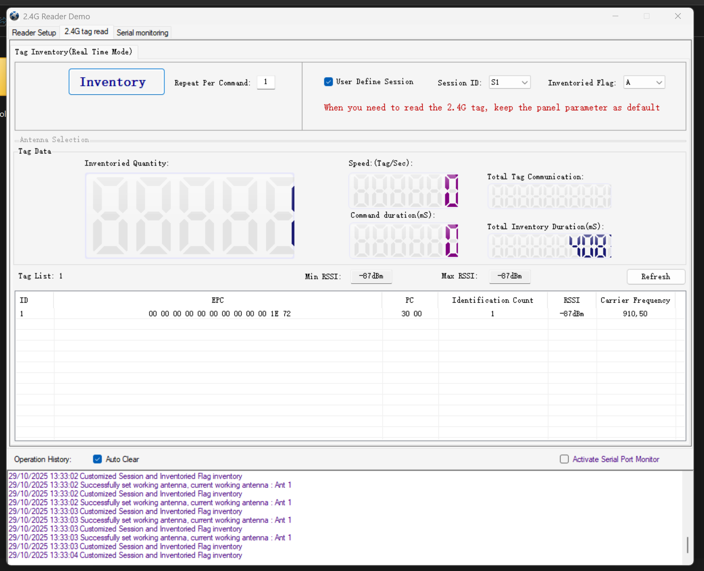

# Invelion YR9700 Active sensor reader

Basic User Manual can be found here: [2.4G+125KHZ Active sensor User Manual](<2.4G+125KHZ Active sensor User Manual.pdf>)
Technical specifications: [YR9700 active 2.45G RFID reader.pdf](<YR9700 active 2.45G RFID reader.pdf>)

The device can be connected using 2 diferent ports but the connection type need to be configured in the dip switch in the back side of the device:
* RS232: enable pins 7 & 8.
* LAN: enable pins 3 & 4.

## Configuring network parameters

When selecting LAN, this device is configured to use IP 192.168.0.178 with DHCP disabled by default.

If the device is not reachable or network configurations have been changed, you can use the [NetModuleConfig](NetModuleConfig.zip) tool to discover the device and configure the correct network parameters. Default configurations can be found on the [Net tool Reset.cfg](<Net tool Reset.cfg>) file. Use the NetModuleConfig tool to upload the configuration file to the device.

Firstly chose the network adapter where the device is connected, then click on "Search" button to discover the device. Once discovered, select the device doing double click on the Module list. You can now tweak the network parameters as needed or click on _Load Config_ button to load andupload the default [Net tool Reset.cfg](<Net tool Reset.cfg>) configuration file.

## Invelion Demo Software

A demo software is provided by Invelion to test the device functionalities. Here you can find it under [2.4g active transponder demo software[EN].rar](<2.4g active transponder demo software[EN].rar>) It containes a Windows executable and the source code developed in C#.

This is a screenshot of the _UHFDemo.exe_ demo software:

 
The device has been connected using the LAN port and the IP configured under the REader Setup tab. After connecting, it has been selected under the 2.4G tag read tab the Session ID S1 and INventoried Flag A. Then clicking on the _Inventory_ button, the active tags in range are detected and shown in the Tag List.

## SDK and protocol reference

Under the [2.4g active transponder demo software[EN].rar](<2.4g active transponder demo software[EN].rar>) can be also found the _UHFDemo_ Windows app source code, containing the SDK developed in C#.

The SDK source code can be officially found also under: http://www.invelion.net/down/html/?12.html --> https://od.lk/f/NzNfMTcxNjA3NzJf

It have been found some Protocol references that could halp with the development:

- [UHF_RFID Serial interface communication protocol_V1.9](<UHF_RFID Serial interface communication protocol_V1.9.pdf>)
- [UHF RFID Reader User´s Manual v1.9](<UHF RFID Reader User´s Manual v1.9.pdf>)
